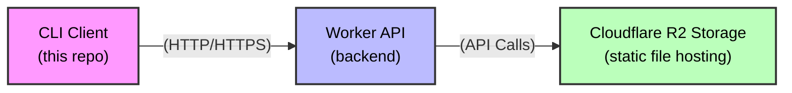

# Launchpd CLI — Wiki

**Deploy static sites instantly to a live URL. No config, no complexity.**

| | |
|---|---|
| **Package** | `launchpd` on npm |
| **Version** | 1.0.6 |
| **License** | MIT |
| **Runtime** | Node.js 20+ |
| **Author** | Kent John Edoloverio |

---

## Table of Contents

### For End Users
1. [Getting Started](Getting-Started.md) — Installation, first deploy, project setup
2. [Command Reference](Command-Reference.md) — Every CLI command with flags and examples
3. [Remote Deployments](Remote-Deployments.md) — Deploy from GitHub repos and Gists
4. [Configuration](Configuration.md) — Project config, credentials, ignore rules
5. [Error Handling](Error-Handling.md) — Error hierarchy, user-facing messages, suggestions
---

## Quick Overview

Launchpd is a CLI tool that deploys static sites (HTML, CSS, JS, images) to `*.launchpd.cloud` subdomains. It supports:

- **Local folder deployment** — point at any directory
- **Remote URL deployment** — deploy directly from GitHub repos or Gists
- **Version control** — every deploy is versioned with rollback support
- **Project linking** — bind a directory to a subdomain via `.launchpd.json`
- **Quota management** — anonymous (limited) and authenticated tiers
- **Auto-expiration** — temporary deployments that self-delete

### How It Works

1. CLI validates the folder (static files only)
2. Files are uploaded to the API with HMAC-signed requests
3. API stores files in R2 under the subdomain namespace
4. Site is live at `https://<subdomain>.launchpd.cloud`
